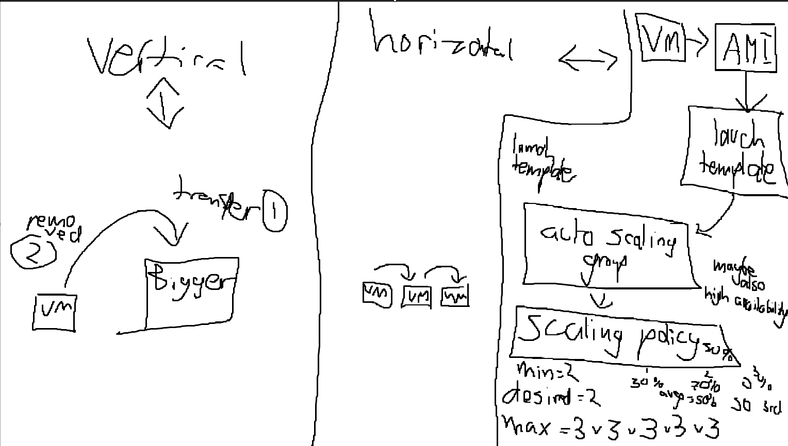
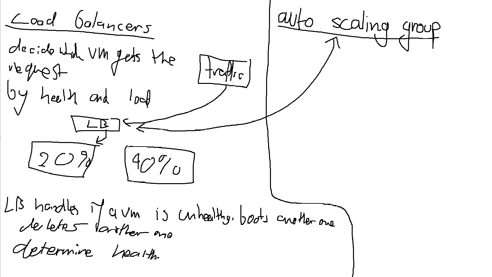
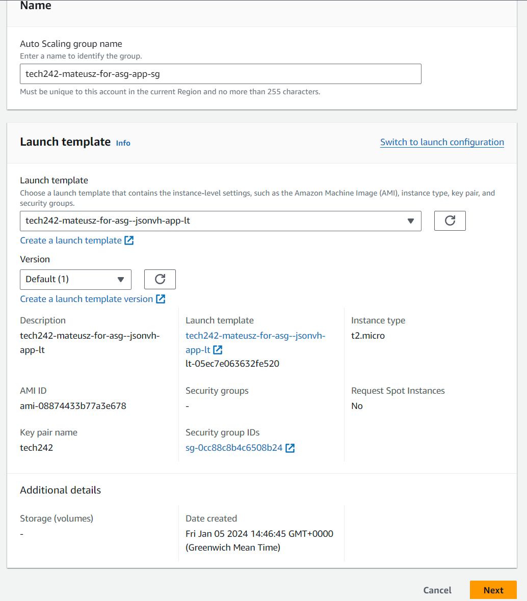
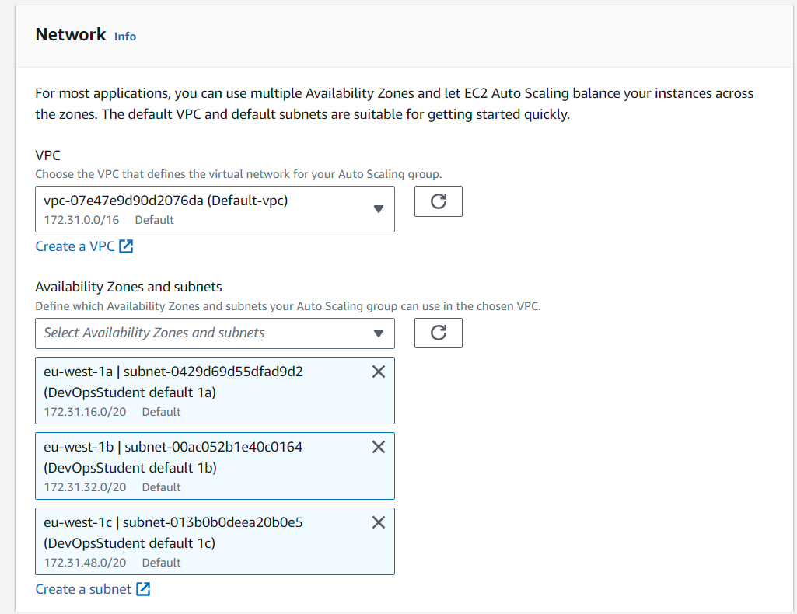
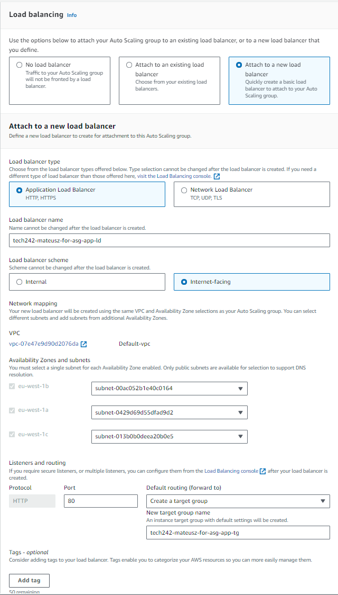
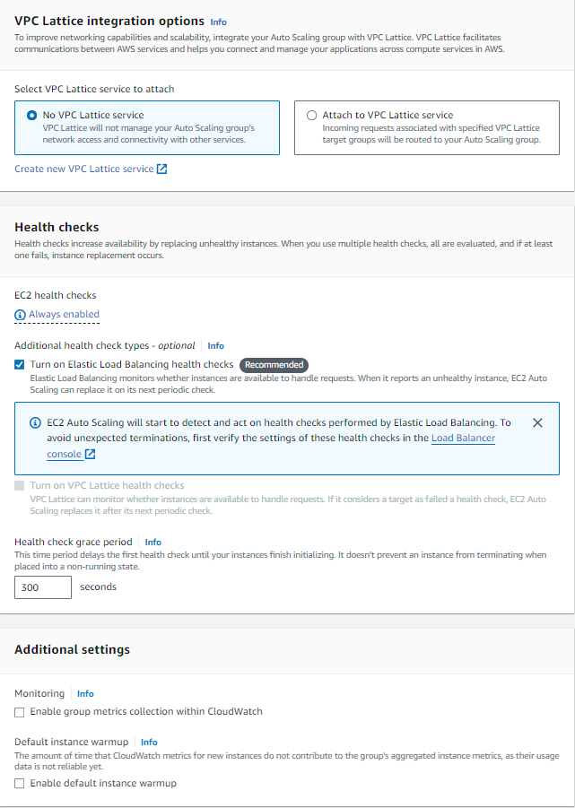
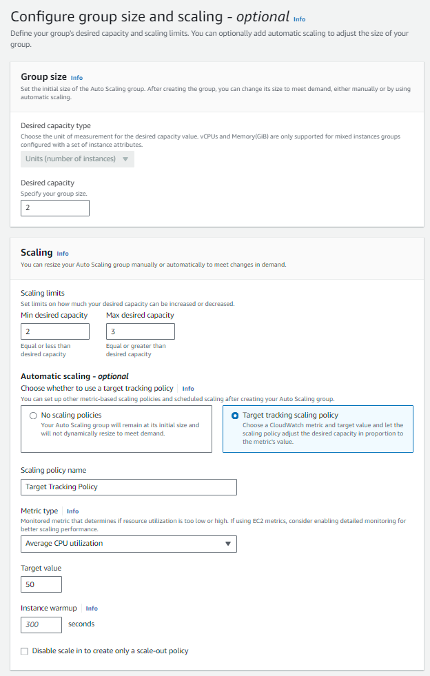
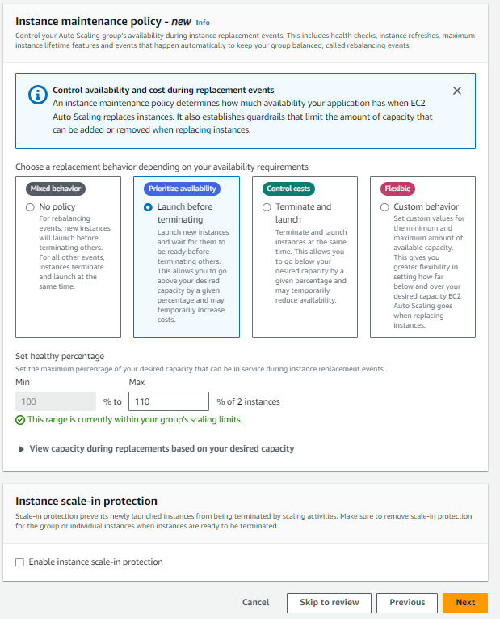
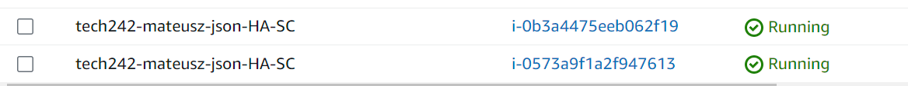
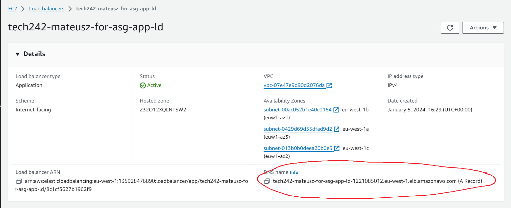

# Scaling
## images

## setting it up
# We first need to name the SG and give it a template to use

# We then need to specify the subnets each of the VM's will be using, for avaialability purposes.

# We will then need to set up a load balancer, since hte ld is accessign external internet traffic it need to accept http reqquests and needs to be set up that way

# we then need to configure how the sclaing will act, settign minimum dsesired and maximum amount of vm's htat can be deployed. We will aslo define how they act when they need to increaese or decrease VM's, or rather when a Vm is unhealthy.

# we can then verify it is running and can use the LD DNS name to access the VM's and use its features.

