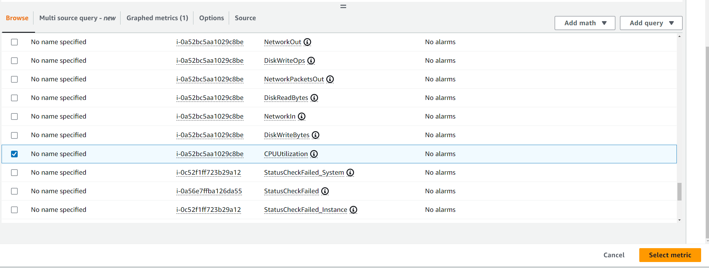

# Alarms and notifications
## We followed this tutorial
#https://docs.aws.amazon.com/AmazonCloudWatch/latest/monitoring/US_AlarmAtThresholdEC2.html
first we create a vm and set up per minute monitoring
we need to link EC2 and per instance monitoring,
make the alarms update per minute also,
set up the threshold to an appropriate percentage,
to notify you need to create a notification and link you account email,
set it to static and average.

# have to wait to gather data

# got an alarm

## Do not rename the matric as for some reason it does not work